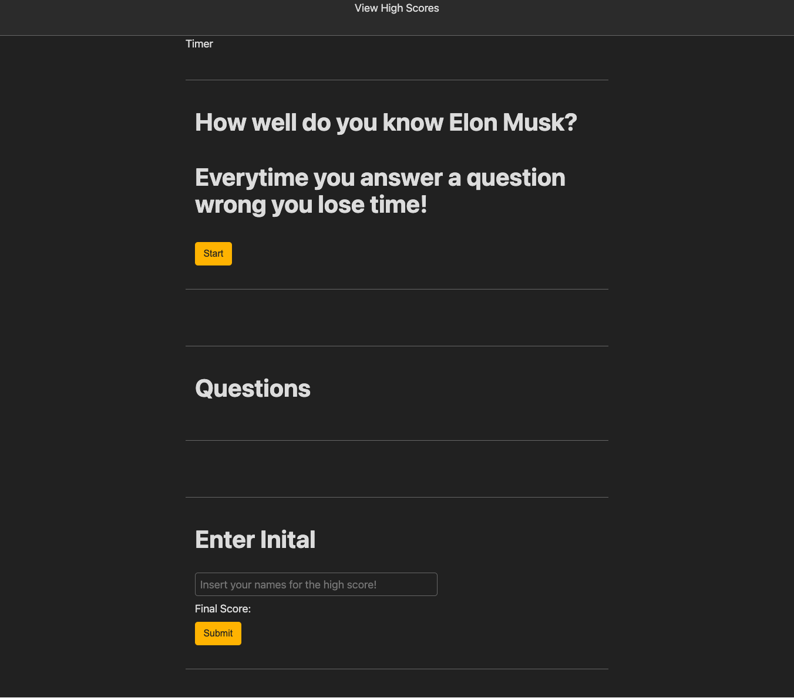

# Timed-Quiz

## Table of Contents
1. [Description](#discription)
2. [Respository](#respository)
3. [Visuals](#visuals)

## Description
no real discripition here. had help from classmates and teaching staff and still cant get anything to work.
i will strive to do better.

## Respository 

- [Respository](https://github.com/VarunTanna/Timed-Quiz)

- [LIVE SITE](https://varuntanna.github.io/Timed-Quiz/)

## Visuals

